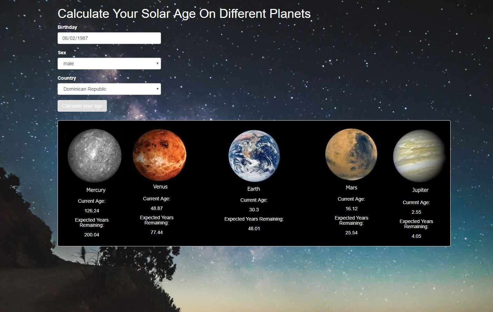

# Solar System Age Calculator

#### Solar System Age Calculator, Sept 2017

#### By Trevor Gill

## Description

_A calculator for determining your "solar age" on other planets in our solar system. The calculator also shows you an remaining life expectancy in other planet's solar years._

## Setup/Installation Requirements
* Clone the repo
* Go to 'localhost:4567' in your preferred browser to launch the application

## Specifications

| Behavior      | Input      | Output       |
| ------------- | ---------- | ------------ |
| The application shall be able to calculate the number of seconds an individual has been alive on Earth based on their birthday | June 2, 1987 | 955238400 seconds |
| The application shall be able to convert Earth "solar years" into solar years on the planets Mercury, Venus, Mars, and Jupiter | Earth years: 30.3 years | Mercury years: 126.21 |
| The application shall be able to display a 'solar year' age on the planets of Mercury, Venus, Earth, Mars, and Jupiter based on a given birthday | June 2, 1987 | Mercury years: 126.21 |
| The application shall be able to display a 'solar year' remaining life expectancy on the planets of Mercury, Venus, Earth, Mars, and Jupiter based on a given birthday, sex, and nationality | Birthday: June 2, 1987, Sex: male, Country: Afghanistan | Mercury years remaining: 168.97 |

# Screenshot

# Known Bugs
_Life expectancy data for a few of the countries in the picklist might not be retrievable via api.population.io._

## Technologies Used
* javascript
* jQuery
* atom
* node
* gulp

### License

Copyright &copy; 2017 Trevor Gill
